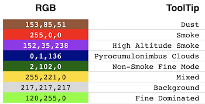

# Available Visualizations

NASA's Global Imagery Browse Services (GIBS) visualization archive includes over 1000 visualizations representing visualized science data from the NASA Earth Observing System Data and Information System ([EOSDIS](https://earthdata.nasa.gov/eosdis){:target="_blank"}). GIBS works closely with EOSDIS science teams and data centers to identify the appropriate data range and color mappings, where appropriate, to provide the highest quality visualization to the Earth science community. Each visualization is generated at the native resolution of the source data to provide "full resolution" visualizations of a science parameter. Those visualizations are then made available through standards-compliant services (See [Visualization Services](../access-basics/#access-basics)) and may be provided in more than one projected coordinate systems (See [Projections & Resolutions](../access-advanced-topics/#projections-resolution)). 

Many GIBS visualizations are generated by the EOSDIS [LANCE](https://earthdata.nasa.gov/lance){:target="_blank"} near real-time processing system resulting in visualizations being available in GIBS within 3.5 hours of observation. These products and others may also extend from present to the beginning of the satellite mission. In addition, GIBS makes available supporting visualizations such as data/no-data, water masks, orbit tracks, and graticules to improve usability.

For a full list of available visualizations, see the [Visualization Product Catalog](#visualization-product-catalog) further down on this page.

## Categories
GIBS visualizations can be separated into the following categories:

### Multi-Band/Spectral
Multi-band (or multi-spectral) visualizations are visible products that have been created through a process of mapping one or more spectral bands to an RGB composite image.  Based on the selection of spectral band "combinations", and how they are mapped to the RGB visible bands, different observations will be made more apparent.  As an example, the MODIS instrument has 36 spectral bands that are typically used to generate a visible image.  There are 210 non-repeating band combinations that can be generated.  As such, GIBS works with its imagery providers to select the "highest value" band combinations for visualization.

### Science Parameter (Raster)
Raster science parameter visualizations are generated by mapping scientific measurements into an RGB image.  Each measured value, or range of values, is assigned a unique color to create a visual representation of the underlying data values. See a sample mapping below:

### Science Parameter (Vector)
Vector science parameter visualizations are generated by mapping scientific measurements into a vector data format. These visualizations are then made available as a raster image as well as the native vector format.  When accessed as a raster image, GIBS applies a default styling.  When accessed as a vector, the client application must apply styling for a user to interact with the visualization. (See [Vector Styles](../access-advanced-topics/#vector-styles)) To present and interpret the properties of the vector data, GIBS provides a metadata document to be utilized by a client application. (See [Vector Properties](../access-advanced-topics/#vector-properties))

### Utility
Utility visualizations are provided to improve imagery viewability.  These layers include data or imagery masks that highlight or remove specific regions of an image and also mapping aids such as graticules and coastlines.

## Visualization Product Catalog
This interactive catalog provides the following information about each GIBS visualization layer.  Visualization products are organized by their "scientific measurement." You may further filter catalog by science discipline.

   * **Platform** - The satellite, aircraft, vessel, ground station, or mission from which data was gathered.
   * **Instrument** - The scientific instrument that gathered the data.
   * **Name/Identifier** - The visualization product's human-readable name and machine-readable identifier.
   * **Period** - The visualization product's temporal period (e.g. `daily`, `monthly`).
   * **Projection(s) [<a href="#footnote-1">1</a>]** - The map projection(s) in which the visualization product is made available through GIBS web services.
   * **Resolution [<a href="#footnote-1">2</a>]** - The visualization product's native resolution used when pre-generating raster or vector tiles for access.
   * **Format** - The visualization product's native format, as used in tile requests (e.g. ` jpeg`, `png`, `vnd.mapbox-vector-tile`).
   * **Temporal Range** - The visualization product's temporal range (e.g. `2002-08-30 - Present`).
   * **Product [<a href="#footnote-1">3</a>] [<a href="#footnote-1">4</a>]** - The science data product(s) utilized in the generation of the visualization product.  These may be one, or both, of Near Real-Time ([LANCE](https://earthdata.nasa.gov/lance){:target="_blank"}) or Standard quality products.  Links are provided to the product's definition in the NASA Common Metadata Repository ([CMR](https://earthdata.nasa.gov/cmr){:target="_blank"}). 

  

    

    

      
There was an error loading products. Please try again later.

    

    

      <category-selector
        v-bind:categories="categories"
        v-bind:selected-category="selectedCategory"
        v-bind:select-category="selectCategory">
      </category-selector>
      

        <measurement-container 
          v-for="measurement in measurements" 
          :key="measurement.title" 
          :measurement="measurement">
        </measurement-container> 
      

    

    

      

        [1] The Geographic projection is WGS84 latitude/longitude, EPSG:4326. The arctic projection is NSIDC Sea Ice Polar Stereographic North, EPSG:3413. The antarctic projection is Antarctic Polar Stereographic, EPSG:3031. The Web Mercator projection is WGS84 latitude/longitude, EPSG:3857.
      

      

        [2] The Imagery Resolution is the resolution of the image offered on the GIBS system. Generally the imagery resolution is of equal or higher resolution than the native or sensor resolution. Web Mercator imagery is generated by re-sampling the geographically projected imagery. In that process, the closest corresponding resolution is used.
      

      

        [3] The Sensor Resolution, also known as native resolution, is provided as a reference not to be confused with the imagery resolution explained in [1]. This is the resolution of the source product elements which went into making the imagery product served in GIBS.
      

      

        [3] NRT - Near Real-Time: The imagery product is generated within 3.5 hours of observation. STD - Standard: The imagery product is generated within 24 hours of observation.
      

       

        [4] When multiple data products are identified, the GIBS visualization product will provide users with a view of the “Best Available” data product.  See the <a href="../api-advanced-topics/#best-available-layers">Best Available Layers advanced topic</a> for more information on how this is determined.
      

    

  

